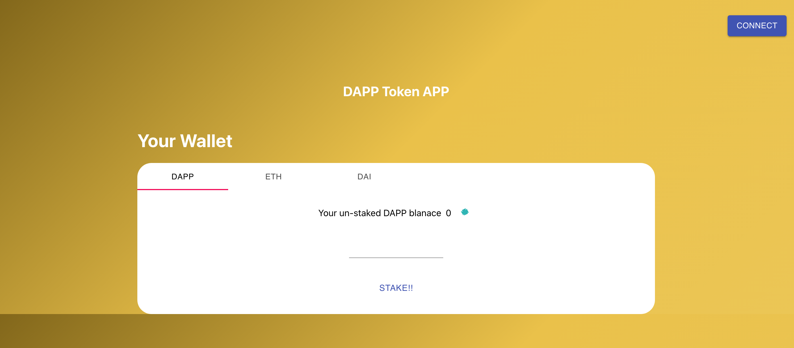
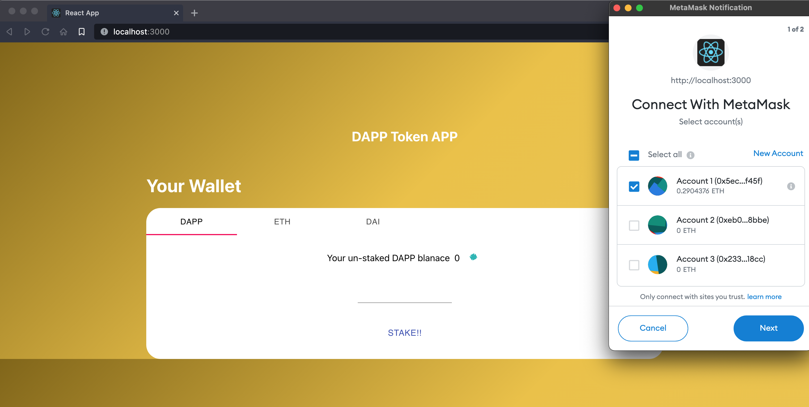
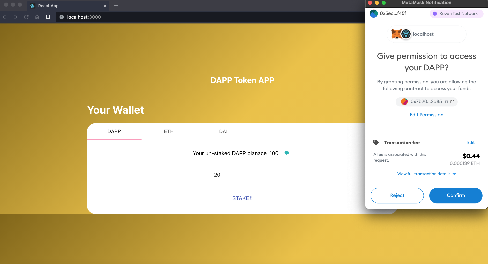
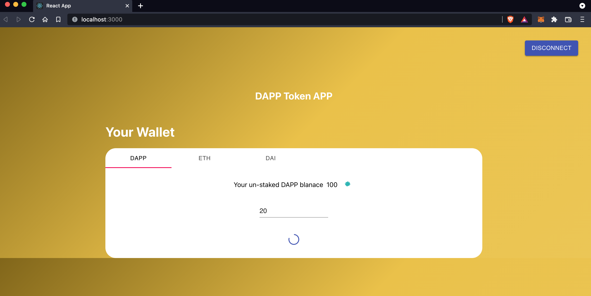
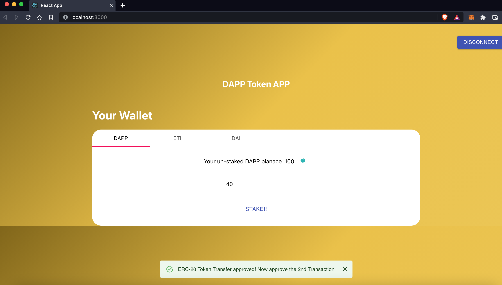

# DAPP-StakeTokens-FullStack

This project portrays the functionality of a TokenFarm where users can stake their Tokens in-return for the DappToken given out by the Token Farm

Currently the front-end is created using React-Js, useDapp/core for connectivity with MetaMask.

The dapp is build and tested using kovan testnetwork.

# DAPP-STAKETOKEN-FRONTEND

# METAMASK Integration

# Staking Tokens

# TOKEN Staked

